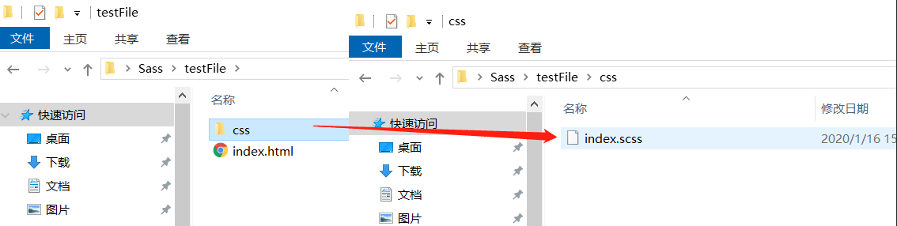
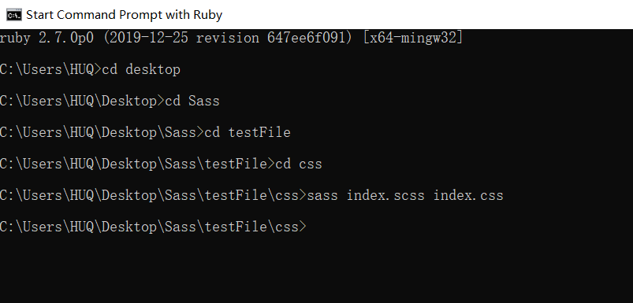
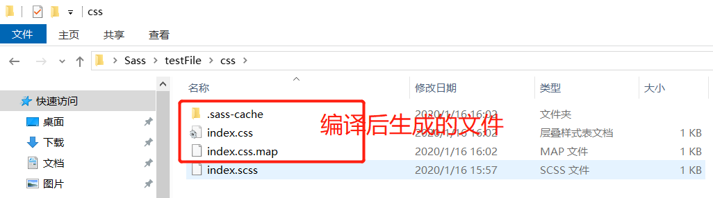
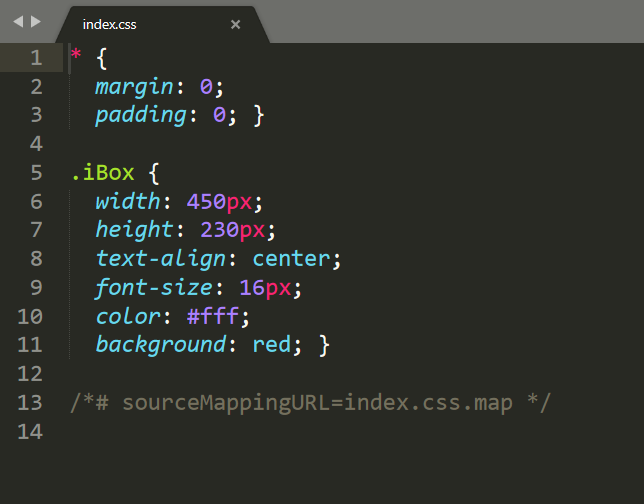
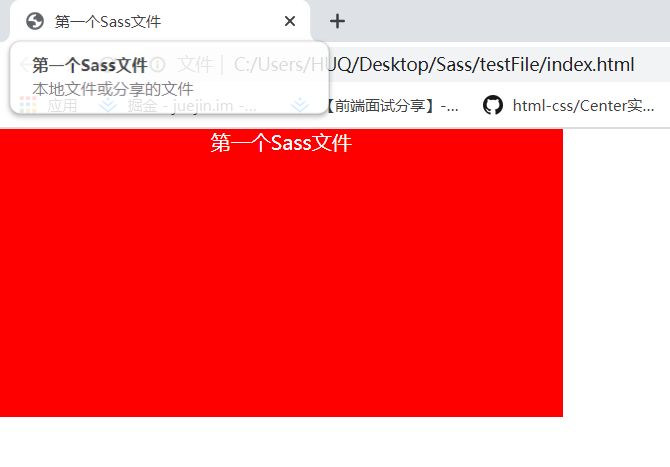

# Sass 本地环境搭建及使用
```
CSS预编译器有 SASS LESS Stylus等等，SCSS是SASS3引入的新语法。
那为什么要选择SCSS呢？那我只能说我喜欢啊！
不管SASS也好，LESS也罢，还是Stylus都只是一种工具，各有各的优缺点，选择自己喜欢的用着舒服的就是了。
```
**准备工作（注意：这是windows平台下的安装）**
+ [Ruby](https://rubyinstaller.org/downloads/)
+ Sass
## 1.1 Ruby安装
#### SASS是Ruby语言写的，但是两者的语法没有关系。所以不懂Ruby，一样可以使用。只是必须先安装[Ruby](https://rubyinstaller.org/downloads/)，然后再安装SASS。
#### 根据自己系统的位数（64 OR 32）选择合适的安装包，下载安装包之后双击打开，一路下一步，完成！
#### 打开ruby的控制台，输入ruby -v，如果出现以下结果，则证明ruby安装成功！
```
ruby -v
```

## 1.2 Sass安装
#### 安装完ruby之后，直接在控制台就可以安装SASS。
```
gem install sass
```
#### 至此，SCSS安装完毕！
## 2.1 Sass编译
#### SASS文件就是普通的文本文件，里面可以直接使用CSS语法。文件后缀名是.scss，意思为Sassy CSS。
#### SASS提供四种编译风格的选项：
+ nested：嵌套缩进的css代码，它是默认值。

+ expanded：标准格式的css代码。

+ compact：行格式的css代码。

+ compressed：压缩后的css代码,一般用于生产环境。
#### 使用方法：
```
sass --style compressed input.scss output.css
```
**对于scss文件，最终要编译成css文件才能使用，编译也很简单，只要再Ruby终端输入：sass input.scss output.css**
#### 在命令行中运行 Sass：
```
sass input.scss output.css
```
#### 监视单个 Sass 文件，每次修改并保存时自动编译：
```
sass --watch input.scss:output.css
```
#### 监视整个文件夹：
```
sass --watch app/sass:public/stylesheets
```
**更多命令的用法请通过 sass --help 获取帮助。**
## 3.1 Sass使用：第一个Sass文件
#### 新建一个名为testFile文件夹，在文件夹里面分别新建一个index.html和css文件夹；然后再在css文件夹中新建一个index.scss：



**index.html：**
```
<!DOCTYPE html>
<html lang="en">
<head>
    <meta charset="UTF-8">
    <title>第一个Sass文件</title>
    <!-- 先编译，再引入编译后的文件 -->
    <link rel="stylesheet" href="css/index.css">
</head>
<body>
    <div class="iBox">第一个Sass文件</div>
</body>
</html>
```
**index.scss：**
```
*{ margin:0; padding:0; }
$box-width:450px;
$box-height:230px;
$box-color:#fff;
$box-bgcolor:red;
.iBox{
    width:$box-width;
    height:$box-height;
    text-align:center;
    font-size:16px;
    color:$box-color;
    background:$box-bgcolor
}
```
**在Ruby终端编译：sass index.scss index.css**




### 然后在index.html文件中引入编译后的文件index.css
**index.css：**



**最终呈现效果：**


### 注意：
&emsp;&emsp;**每次修改index.scss文件后都要再次编译，不然修改的样式不能呈现**
