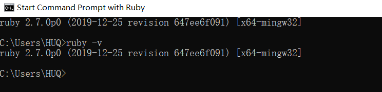

# Sass 安装与使用
```
CSS预编译器有 SASS LESS Stylus等等，SCSS是SASS3引入的新语法。
那为什么要选择SCSS呢？那我只能说我喜欢啊！
不管SASS也好，LESS也罢，还是Stylus都只是一种工具，各有各的优缺点，选择自己喜欢的用着舒服的就是了。
```
**准备工作（注意：这是windows平台下的安装）**
+ [Ruby](https://rubyinstaller.org/downloads/)
+ Sass
## 1.1 Ruby安装
#### &emsp;&emsp;SASS是Ruby语言写的，但是两者的语法没有关系。所以不懂Ruby，一样可以使用。只是必须先安装[Ruby](https://rubyinstaller.org/downloads/)，然后再安装SASS。
#### &emsp;&emsp;根据自己系统的位数（64 OR 32）选择合适的安装包，下载安装包之后双击打开，一路下一步，完成！
#### &emsp;&emsp;打开ruby的控制台，输入ruby -v，如果出现以下结果，则证明ruby安装成功！
```
ruby -v
```

## 1.2 Sass安装
#### &emsp;&emsp;安装完ruby之后，直接在控制台就可以安装SASS。
```
gem install sass
```
#### &emsp;&emsp;至此，SCSS安装完毕！
## 2.1 Sass使用
#### &emsp;&emsp;SASS文件就是普通的文本文件，里面可以直接使用CSS语法。文件后缀名是.scss，意思为Sassy CSS。
#### &emsp;&emsp;SASS提供四种编译风格的选项：
+ &emsp;&emsp;nested：嵌套缩进的css代码，它是默认值。
+ &emsp;&emsp;expanded：标准格式的css代码。
+ &emsp;&emsp;compact：行格式的css代码。
+ &emsp;&emsp;compressed：压缩后的css代码,一般用于生产环境。
#### &emsp;&emsp;使用方法：
```
sass --style compressed input.scss output.css
```
**对于scss文件，最终要编译成css文件才能使用，编译也很简单，只要再终端输入：sass input.scss output.css**